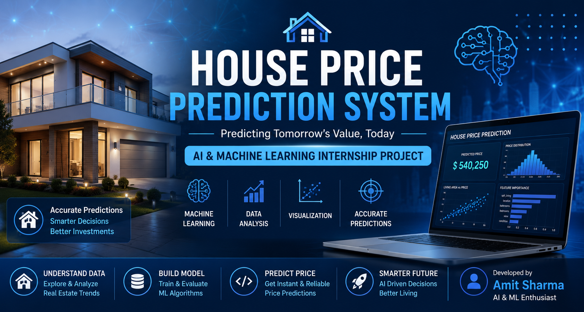
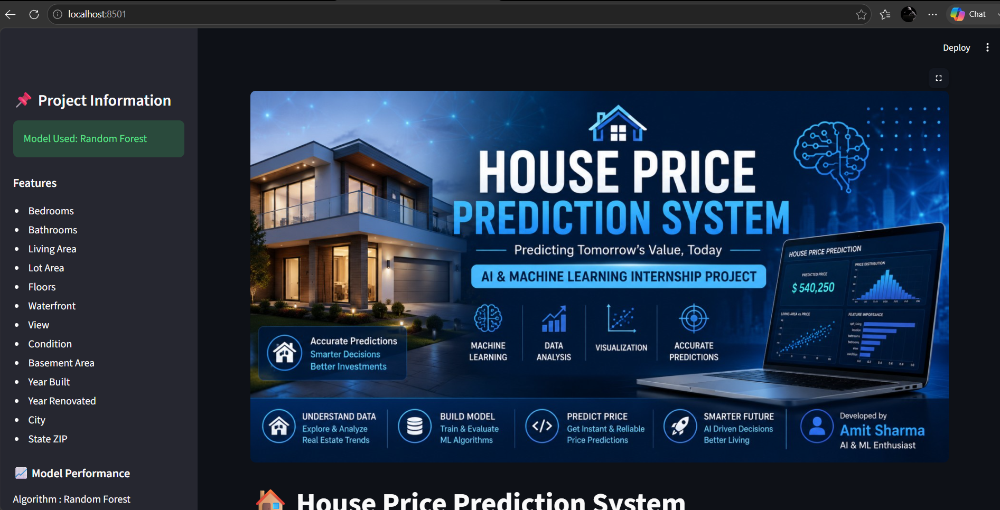
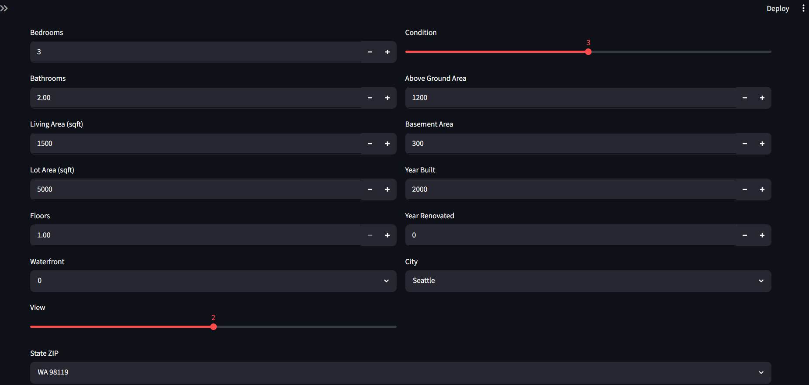
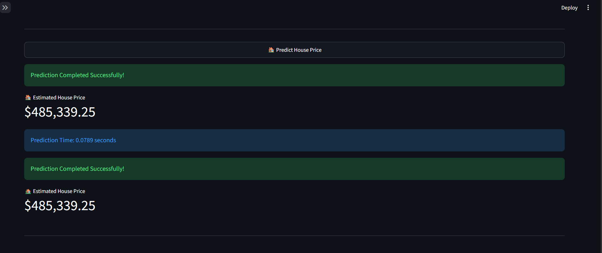
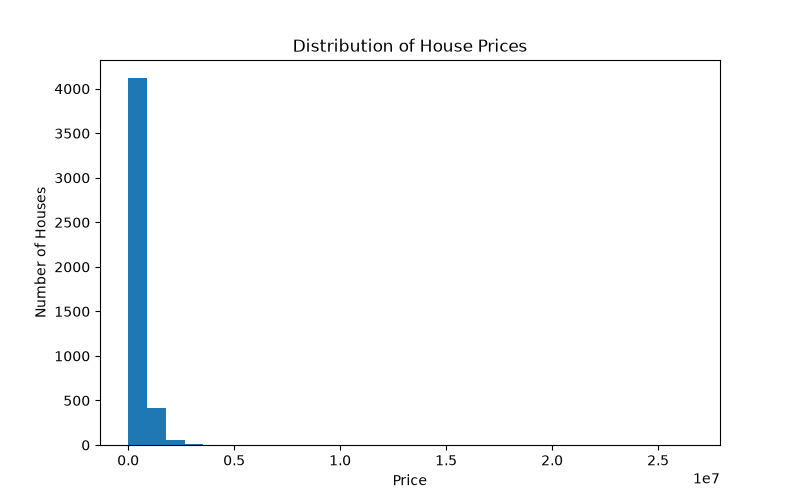
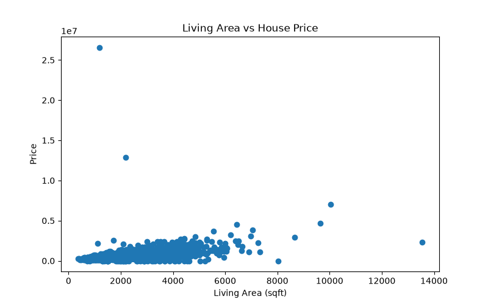
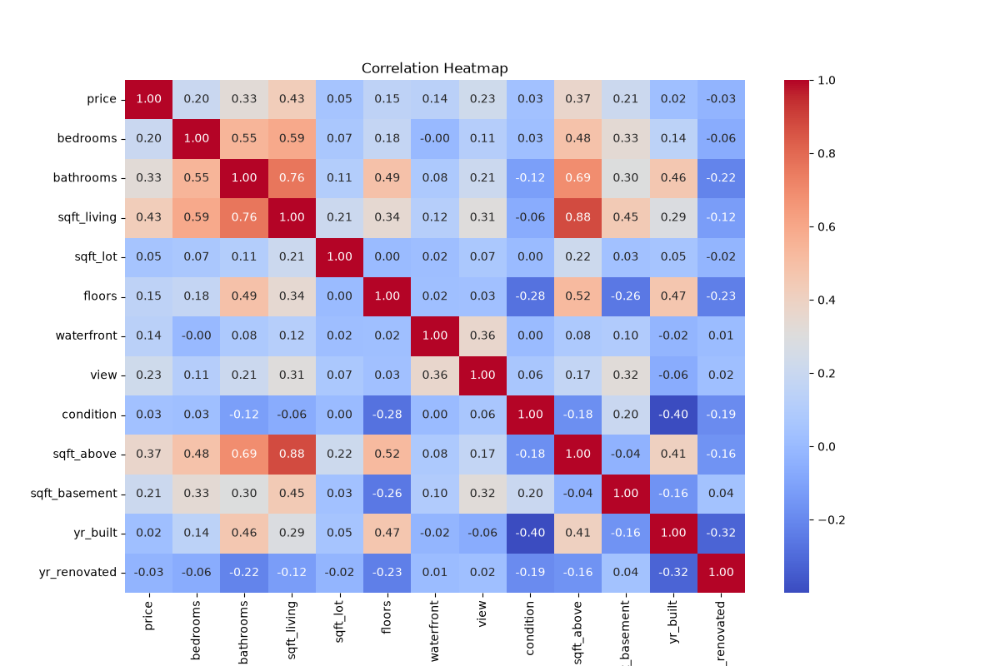

# 🏠 House Price Prediction System

## 📌 Project Overview

This project predicts house prices using Machine Learning based on various house features such as bedrooms, bathrooms, living area, lot area, year built, location, and more.

The project uses Random Forest Regression as the final prediction model and is deployed using Streamlit.

---

## 🎯 Objective

To build a machine learning model that predicts house prices accurately using historical housing data.

---

## 🛠 Technologies Used

- Python
- Pandas
- NumPy
- Matplotlib
- Scikit-learn
- Streamlit
- Joblib

---

## 📂 Dataset

The dataset contains 4600 house records with features such as:

- Bedrooms
- Bathrooms
- Living Area
- Lot Area
- Floors
- Waterfront
- View
- Condition
- Above Ground Area
- Basement Area
- Year Built
- Year Renovated
- City
- State ZIP
- Price

---

## 🤖 Machine Learning Models

- Linear Regression
- Decision Tree Regressor
- Random Forest Regressor ✅

Random Forest gave the best performance among all models.

---

## 📊 Model Evaluation

| Model | R² Score |
|--------|----------|
| Linear Regression | 0.033 |
| Decision Tree | -0.001 |
| Random Forest | 0.043 |

---

## 🚀 Features

- Data Cleaning
- Exploratory Data Analysis
- Feature Engineering
- Model Training
- Model Evaluation
- House Price Prediction
- Streamlit Web Application

---

# 🏠 House Price Prediction System



## 📷 Project Screenshots

### Home Page


### Input Form


### Prediction Result


### Price Distribution


### Living Area vs Price


### Correlation Heatmap


---

## ▶️ How to Run

1. Clone the repository

2. Install the required libraries

```
pip install -r requirements.txt
```

3. Run the application

```
streamlit run app.py
```

---

## 📌 Future Scope

- Improve prediction accuracy
- Use One-Hot Encoding
- Hyperparameter tuning
- Deploy on Streamlit Cloud

---

## Model File

The trained `model.pkl` file is not included in this repository because it exceeds GitHub's web upload size limit.

To generate it:

1. Run `main.py`
2. The trained model will be saved automatically in the `models` folder.

## Live Demo

https://house-price-prediction-system-018.streamlit.app

## 👨‍💻 Developed By

**Amit Sharma**

AI & ML Internship Project

Rajkiya Engineering College Mainpuri
